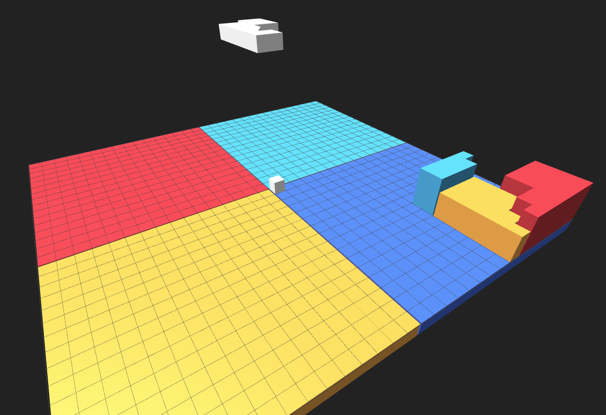

# 3D Hilbert Visualizer

An embed to visualize ranges of one dimensional data, in 3D space. An example of this is visualizing IP addresses.




# Running example code
The example code is located in the example directory. [Looking for a react example?](https://github.com/CircleClick/react-example-3D-Hilbert)

Download this repo, run NPM install, then start the example server using `npm run dev`.

# installing
Add to your project by running 
```sh
npm i --save https://github.com/CircleClick/3D-Hilbert-Visualization
```

# usage

```js
import HilbertVisualizer from '3DHilbertVisualizer';

const visualizer = new HilbertVisualizer({
	hilbertSize: 10, // how many bits the hilbert grid you're making is, entire IPv4 space would be 32
});

visualizer.spawnHilbertMesh(
	0, //start
	255, //end
	0, //height the geometry will start at
	1, //height the geometry will end at
	0xffffff, //color of the geometry
	{ onclick: ()=>{alert("I've been clicked!")} } // optional data, onClick property will be called when the user clicks the geometry
);

visualizer.moveCameraToHilbert(
	255, //move the camera to the end of our new mesh
	10 //put the camera "back" 10 units so we can see the scene better
);
```

`hilbertSize` indicates how big your "grid" is going to be, `32` covers all of IPv4 space. The number is fed into Math.pow(2, hilbertSize) to inform the hilbert curve algorithm on where to place elements.

# Working with IP addresses
IP addresses formatted as `192.168.0.1` are decimal numbers formatted to be more human readable. You can convert them back into integers using a function like this:

```js
function ip2int(ip) {
    return ip.split('.').reduce(function(ipInt, octet) { return (ipInt<<8) + parseInt(octet, 10)}, 0) >>> 0;
}
```


When visualizing a network of IP addresses, it can be helpful to restrict the hilbert grid to the size of the subnet you're dealing with.

A 10.0.0.0 network is 24 bits, so if you want to visualize just that, you'll want to set `hilbertSize` to 24. The end result is you'll be able to visualize numbers from 0 to `Math.pow(2, 24)`, or 16777216. When using this technique, you must subtract the start of the IP range from any numbers you feed in, it'll look like this:

```js
const baseStart = ip2int('10.0.0.0');

const ipStart = ip2int('10.0.1.0');
const ipEnd = ip2int('10.0.3.0');
visualizer.spawnHilbertMesh(ipStart - baseStart, ipEnd - baseStart, 0, 1, 0xffffff);
```
---
# other
...

Old example, for reference: 

[https://ipv4-hilbert.netlify.app/?ip_block=194&focus=194.15.120.0](https://ipv4-hilbert.netlify.app/?ip_block=194&focus=194.15.120.0)